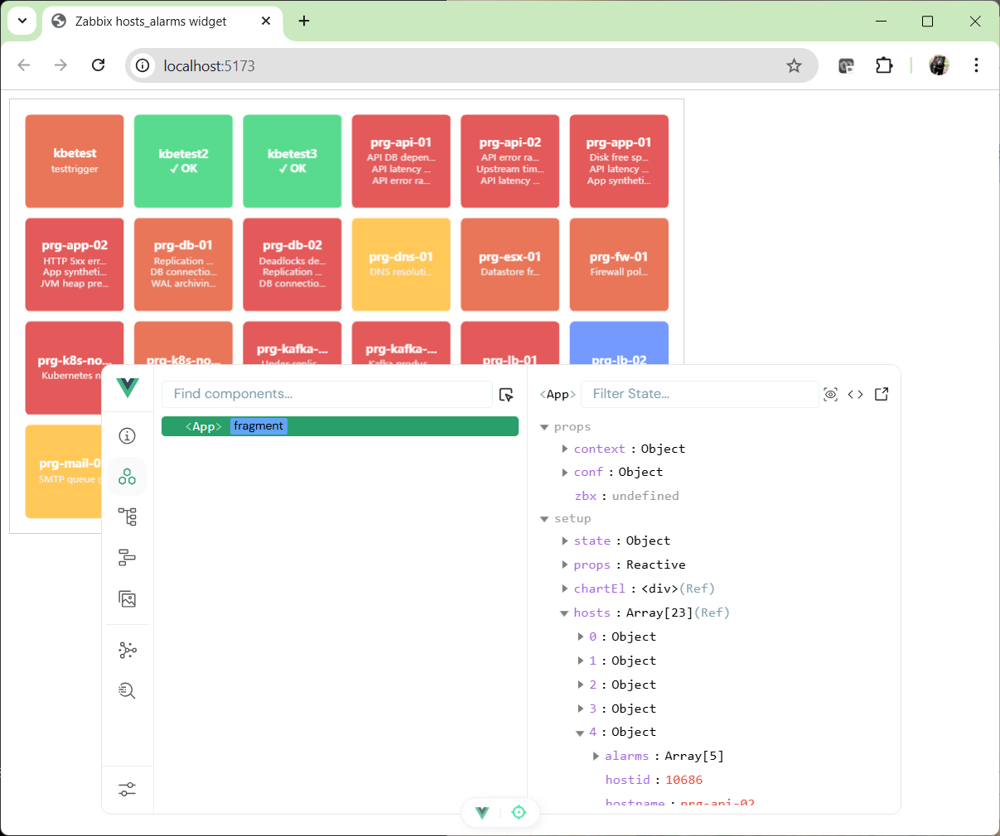
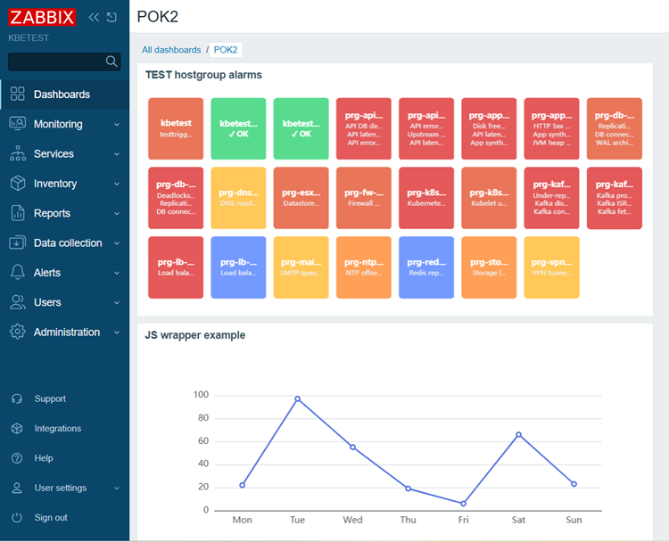

# BUILD and Development (`hosts_alarms`)

This document explains how to run the module in local development mode, build UMD artifacts, and deploy them for use with the Zabbix `js_wrapper` module.

## Project Origin

The base project skeleton was created following the official Vue Quick Start approach:

- https://vuejs.org/guide/quick-start

## 1. Prerequisites

- Node.js version compatible with `package.json` engines (`^20.19.0 || >=22.12.0`)
- npm

## 2. Install Dependencies

```sh
cd zbx_widget_hosts_alarms_UMD_module
npm install
```

## 3. Local Development (outside Zabbix)

During development you can run the widget as a standalone Vue app, without Zabbix:

```sh
npm run dev
```

Benefits:

- fast frontend iteration with Vite hot reload,
- ability to inspect component state and tree via Vue DevTools,
- easy simulation of widget resizing via the local resizable host container in `index.html`.

In this mode, the app is served by Vite and rendered through `src/main.js`.

Local development screenshot:



## 4. Build UMD Library for Zabbix Wrapper

To build deployable UMD artifacts used by `js_wrapper`:

```sh
npm run build:lib
```

Build configuration is in `vite.lib.config.js`.

Expected outputs:

- `dist/hosts_alarms.umd.js`
- `dist/hosts_alarms.css`

Note: Vue and ECharts are bundled directly into the UMD file (not externalized).

## 5. Deploy Artifacts to `js_wrapper`

Copy built files into Zabbix wrapper assets:

```sh
cp dist/hosts_alarms.umd.js ../js_wrapper/assets/umd/hosts_alarms.umd.js
cp dist/hosts_alarms.css ../js_wrapper/assets/umd/hosts_alarms.css
```

Then in Zabbix widget configuration set:

- `component`: `hosts_alarms`
- `conf_json`: valid JSON. Under js_wrapper 1.1+ the session mode needs no token; the
  token mode needs `apikey` - see "Access Modes" in `README.md`

Example `conf_json` (session mode):

```json
{
    "api": "session",
    "hostgroup": "Linux servers"
}
```

Example `conf_json` (token mode):

```json
{
    "apikey": "<ZABBIX_API_TOKEN>",
    "hostgroup": "Linux servers"
}
```

Zabbix dashboard result screenshot:



## 6. Optional Commands

Lint and formatting helpers:

```sh
npm run lint
npm run format
```

## 7. Troubleshooting

- If the widget does not load in Zabbix, verify both files exist in `js_wrapper/assets/umd/`.
- If global API is not found, check that `src/entry.js` publishes `window.hosts_alarms`.
- If UI renders in local dev but not in Zabbix, re-check wrapper `component` value and artifact file names.
- If no data is shown, verify `conf_json` values and the permissions of the identity in
  use (the logged-in user in the session mode, the token user in the token mode); the
  browser console carries the API error.
- If the script fails with `ReferenceError: process is not defined`, the build predates
  the top-level `define` in `vite.lib.config.js` - rebuild.

